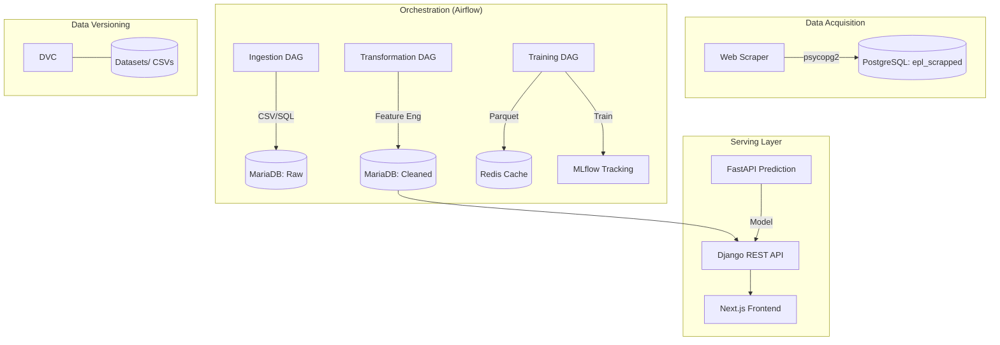

# Architecture

## System diagram

## Module map
| Module | Responsibility |
|--------|----------------|
| `src/components` | Core logic for Ingestion, Validation, Transformation, and Training. |
| `src/entity` | Data classes and configuration schemas. |
| `src/pipeline` | Orchestration wrappers for individual ML stages. |
| `dags/` | Airflow DAG definitions calling the pipeline wrappers. |
| `football_api/` | Django app handling Team/Match metadata and standings. |
| `frontend/src` | Next.js components and state management. |

## Data flow
1. **Daily Update**: Scraper pulls match stats from API -> Postgres.
2. **ETL Sync**: Airflow pulls from Postgres/Datasets -> MariaDB.
3. **ML Pipeline**: Data transformation computes rolling form/stats -> Loaded to Redis -> XGBoost training -> Best model registered in MLflow.
4. **User Request**: User views standings (Django) or asks for prediction (Django -> FastAPI/Model).

## Database schema
- **PostgreSQL (`epl_scrapped`)**: Table `PREMIER_LEAGUE_MATCHES_5`. Columns: `DT`, `HT`, `AT`, `FTHG`, `FTAG`, `FTR`, etc. (Uppercase abbreviations).
- **MariaDB (`cleaned_data_database_2`)**: Table `final_dataset`. Standardized features for ML (e.g., `HTGD`, `ATGD`, `HTP`, `ATP`).
- **Django DB**: Standard relational schema for `Team` and `Match` objects.

## External integrations
- **MLflow**: Experiment tracking and model registry.
- **DVC**: Large file storage and dataset versioning.
- **Great Expectations**: (Planned/Partial) Data quality gates.

## Auth & authorization
- **Django**: Uses standard session-based auth for admin and JWT/DRF for potential future API clients.
- **Pipeline**: Relies on `.env` credentials for DB access.

## State management
- **Frontend**: Currently relies on standard React state and potentially Axios for data fetching.

## Background processing
- **Airflow**: Handles all scheduled jobs (Scraping, ETL, Retraining).
- **Redis**: Acts as an in-memory data bridge for the ML components.

## Configuration model
- **YAML Based**: `config.yaml` (Paths), `params.yaml` (Hyperparameters), `schema.yaml` (Data types).
- **Environment**: `.env` handles secrets and container hostnames.

## Performance considerations
- **Caching**: Redis is used to avoid expensive MariaDB reads during high-frequency model training/tuning.
- **Vectorization**: Pandas/NumPy used for feature engineering.

## Security considerations
- **Environment Secrets**: Do not commit `.env`.
- **Validation**: Strict schema validation in `data_validation.py` to prevent SQL injection or corrupted ML training.
