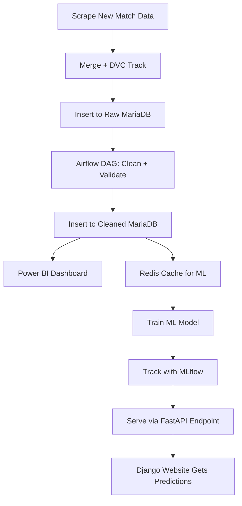

# README.md file

# ⚽ English Premier League Match Prediction - End-to-End Machine Learning Pipeline

## 📌 Project Overview

This project presents a complete **end-to-end machine learning pipeline** to predict English Premier League (EPL) match outcomes and betting probabilities. Built entirely using containerized local infrastructure, the system integrates **data engineering**, **machine learning**, **data validation**, and a **production-grade Django web application**. Our aim is to deliver accurate, real-time predictions along with rich statistical insights via a high-quality web interface — without relying on any cloud services.

---

## 🚀 Key Features

- ✅ End-to-end data pipeline using Apache Airflow
- 📦 Containerized architecture with Docker
- 🧹 Data cleaning, validation & versioning with Great Expectations & DVC
- 📊 Power BI integration for data visualization
- 🧠 ML model training with Redis caching and MLflow tracking
- 🔌 Real-time prediction via FastAPI endpoint
- 🌐 Fully functional web application built with Django
- 🔁 Daily scraping and automated model retraining

---

## 🧱 Project Architecture

The complete workflow can be summarized as:

1. **Raw Data Ingestion**

   - EPL match data (CSV from Kaggle) ingested into **MariaDB (Container 1)** using Airflow.

2. **Data Cleaning and Validation**

   - Separate Airflow DAGs clean and validate data using **Great Expectations**.
   - Cleaned data is stored in **MariaDB (Container 2)**.

3. **Data Analytics and Visualization**

   - **Power BI Desktop** connects to MariaDB (cleaned) for generating insights.
   - Optional FastAPI layer between Power BI and MariaDB.

4. **Model Training Pipeline**

   - Cleaned data is loaded into **Redis (Container 3)** for quick access.
   - Airflow DAG loads data from Redis, performs validation, and trains models.
   - **MLflow** used to track experiments and log best model.
   - Best model is served through a **FastAPI** prediction endpoint.

5. **Web Scraping & Daily Update Cycle**

   - Airflow DAG scrapes daily match and team data from online sources.
   - Scraped data is merged and version-controlled using **DVC**.
   - Data re-enters the pipeline, triggering preprocessing and retraining.

6. **Production Web Application**
   - Developed in **Django**, the frontend displays:
     - Live match stats, fixtures, standings
     - Match predictions & betting probabilities (predicted 1 day before kickoff)
   - Interacts with FastAPI to get prediction results in real time.

---

## 🧰 Tech Stack

| Layer                    | Technology                      |
| ------------------------ | ------------------------------- |
| **Containerization**     | Docker                          |
| **Database**             | MariaDB                         |
| **Orchestration**        | Apache Airflow                  |
| **Caching**              | Redis                           |
| **Data Validation**      | Great Expectations              |
| **Data Version Control** | DVC                             |
| **Model Tracking**       | MLflow                          |
| **API Backend**          | FastAPI                         |
| **Web Framework**        | Django                          |
| **Data Visualization**   | Power BI                        |
| **Web Scraping**         | Python + BeautifulSoup/Requests |
| **ML/EDA**               | Pandas, Scikit-learn, NumPy     |

---

## 📅 Daily Workflow Summary

