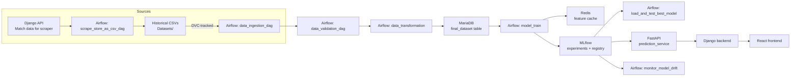

# ⚽ English Premier League Match Prediction - End-to-End ML & Data Pipeline

## Overview
This repository delivers a fully local, containerized data and ML platform for English Premier League (EPL) match prediction. It combines data ingestion, validation, feature engineering, model training, experiment tracking, API serving, and a production-style web application. The stack is orchestrated with Apache Airflow and runs without any cloud dependencies.

## Architecture at a Glance

```mermaid
flowchart LR
  subgraph Sources
    A[Historical CSVs<br/>Datasets/] -->|DVC-tracked| B[Airflow: data_ingestion_dag]
    S[Django API<br/>Match data for scraper] --> T[Airflow: scrape_store_as_csv_dag]
    T --> A
  end

  B --> C[Airflow: data_validation_dag]
  C --> D[Airflow: data_transformation]
  D --> E[MariaDB<br/>final_dataset table]
  E --> F[Airflow: model_train]
  F --> G[Redis<br/>feature cache]
  F --> H[MLflow<br/>experiments + registry]
  H --> I[Airflow: load_and_test_best_model]
  H --> J[FastAPI<br/>prediction_service]
  J --> K[Django backend]
  K --> L[React frontend]

  H --> M[Airflow: monitor_model_drift]
```

## End-to-End Data Pipeline (Airflow)
All pipeline stages are scheduled and monitored through Airflow (`astro_airflow_mlflow`). DAG names below match current `dag_id` values; suffixes vary due to legacy naming and are kept for compatibility.

1. **Scrape & Snapshot** (`scrape_store_as_csv_dag`)
   - Pulls match data from the Django API.
   - Stores it in PostgreSQL and exports a CSV snapshot into `Datasets/`.

2. **Ingestion** (`data_ingestion_dag`)
   - Copies all CSVs from `Datasets/` into the Airflow artifacts ingestion folder.

3. **Validation** (`data_validation_dag`)
   - Enforces column presence and dtype compatibility using `astro_airflow_mlflow/schema.yaml`.
   - Fails fast if any dataset does not match the required contract.

4. **Transformation & Feature Engineering** (`data_transformation`)
   - Generates team form, points, goal difference, matchweek features, and a final feature table.
   - Writes the transformed dataset into MariaDB (`final_dataset` table).

5. **Model Training & Tracking** (`model_train`)
   - Loads the curated dataset from MariaDB, caches it in Redis, and trains an XGBoost classifier.
   - Logs metrics, plots, and model artifacts to MLflow.

6. **Model Testing** (`load_and_test_best_model`)
   - Loads the latest registered MLflow model and evaluates it on train/test splits.
   - Logs accuracy, F1 score, confusion matrix, and classification report.

7. **Drift Monitoring** (`monitor_model_drift`)
   - Aggregates MLflow metrics over time, detects significant drift, and saves trend plots.

## Serving & Product Experience
- **FastAPI Prediction Service** (`prediction_service/`)
  - Loads the MLflow-registered model at startup.
  - Fetches feature inputs from PostgreSQL and returns match outcome probabilities.

- **Django Backend + React Frontend** (`Full_Stack_WebApp/`)
  - Django exposes match data for the scraper and consumes the FastAPI prediction endpoint.
  - React renders fixtures, tables, team views, and prediction outputs.

## Core Data Stores
| Store | Purpose |
| --- | --- |
| **PostgreSQL** | Source of scraped match data and Django application storage |
| **MariaDB** | Curated, transformed dataset for ML training |
| **Redis** | Cached feature store for model training tasks |
| **MLflow** | Experiment tracking, metrics, and model registry |
| **DVC** | Versioning for the `Datasets/` CSV snapshots |

## Repository Structure
```
.
├── astro_airflow_mlflow/      # Airflow DAGs, ML pipeline, feature engineering
├── prediction_service/        # FastAPI model serving layer
├── Full_Stack_WebApp/          # Django backend + React frontend
├── Datasets/                  # DVC-tracked CSV datasets
├── docker-compose.yml         # Shared infrastructure (DBs, Redis, MLflow, FastAPI)
└── README.md
```
Directory names above match the repository’s actual casing; legacy naming is preserved for compatibility with existing paths and configs.

## Key Technology Stack
- **Orchestration**: Apache Airflow (Astro project)
- **Datastores**: PostgreSQL, MariaDB, Redis
- **Modeling**: Scikit-learn + XGBoost
- **Experiment Tracking**: MLflow
- **Serving**: FastAPI
- **Web App**: Django REST API + React
- **Data Versioning**: DVC

## Local Infrastructure (Docker Compose)
The root `docker-compose.yml` provisions shared services used by the pipeline:
- PostgreSQL, MariaDB, Redis
- MLflow tracking server
- FastAPI prediction service

Airflow services (webserver, scheduler, triggerer) run via the Astro project and join the same Docker network.

---

### Notes
- The stack is designed for local execution and experimentation.
- Pipeline outputs (datasets, models, plots) are stored in `astro_airflow_mlflow/artifacts/`.
- For detailed component-specific setup, see the README inside `Full_Stack_WebApp/` and the DAGs inside `astro_airflow_mlflow/dags/`.
